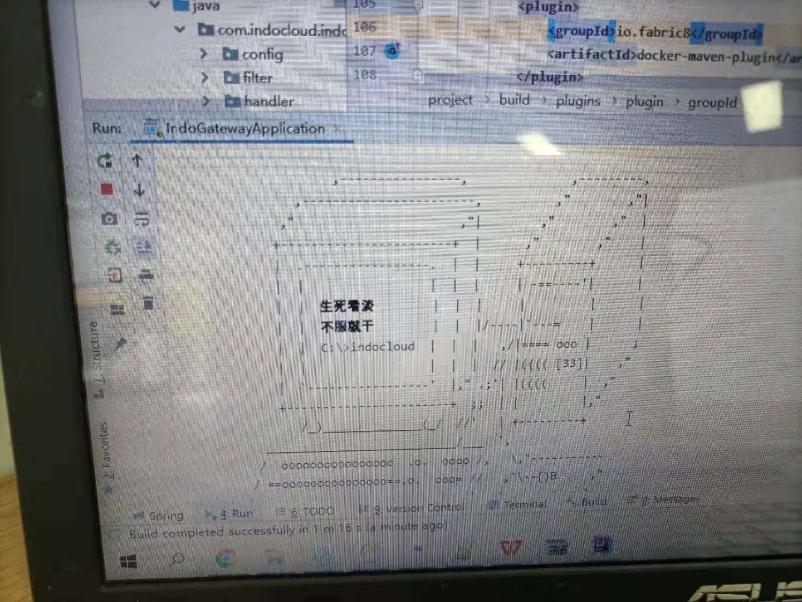
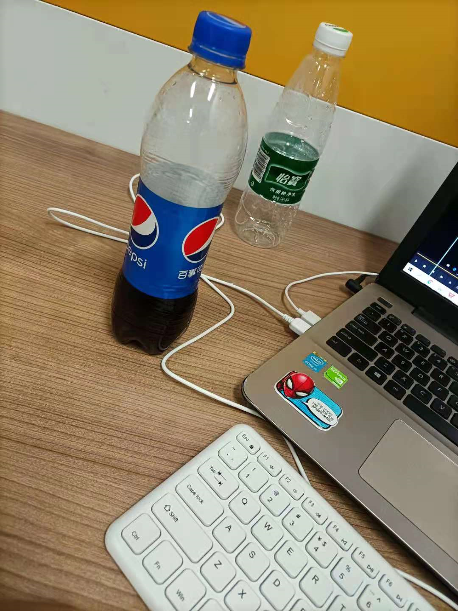
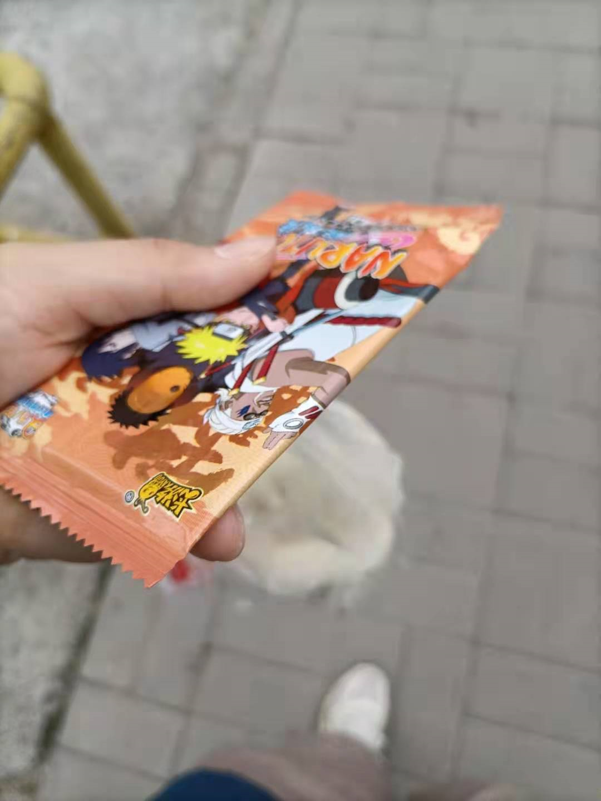

### 210722

现在是晚上十点整，

想到没，竟然没时间记Log。

我只想说，框架你们慢点秀，老子跟不上。

今天是园区上班的第二天，

所谓工资，线是怎样划定，根本就是你租房，水电，吃饭，出行等的总和再往下压一压，当这些费用正常是78块的时候，你的工资就是70块，当正常是5块时，你的工资就是3块。压低到让你不至于死亡，不必满足正常需求的舒适，又必须继续困在工作。

当你维持最低生活的费用是78块，生产的价值是100块时，你的工资是70块；

当你维持最低生活的费用是78块，生产的价值是300块时，你的工资是73块；

当你维持最低生活的费用是78块，生产的价值是700块时，你的工资是80块；

你明白了吗？？标准是怎么制定的？？

当你难以用水，当你难以吃饭，你就会做任何冒险的事情。当你难以安稳住房，则不会发生什么，除了你绵长的痛苦。当你不能被保护地爱人，不能拥有安全感，社会上载歌载舞灯火通明，只有你自己痛苦而已，则也不会发生什么，除了一个安静的抑郁症的你。

或者一个坚毅，追求美好和正直的我。

今天是第二天，

今天给我git权限，让我运行项目，md跑了一上午加中午，午休了十分钟吧，2、3点的时候跑起来了【以后的我看到这里以为只是普通的一句话，但是并不普通，你知不知道万事开头难，我今天经历了啥你知道不，框架和框架的框架，微服务架构，我都不会，我又不能问因为我不能让组里一开始就对我有菜的印象，而且不能让园子里的人过于了解真实的"人间疾苦" 那我会很难办】。然后让我测一下接口，看看流程。

晚上7：50我收包赶车去了，我寻思要在那边租房子。竟然有点舍不得这边宿舍...要不是充电花钱不方便，这边人多，有空调，便宜，对我来说还是挺不错

“我他娘的好怕被辞退啊”

"刀尖上舔血"

"我不看我干坐着吗"

"给我整的汗流浃背的"

去粗取精、去伪存真、由此及彼、由表及里

有鼓励作用的：

组长很照顾我，中午叫我一块吃饭，

起开基本项目时，打印生死看淡，不服就干

穷逼群bb🔪，明天看能不能一块在健身房运动

粘一点照片：

组长喝了半瓶之后给我了

第一天早上买水的时候顺手买的

给我起反作用的：

艾朱，搞屁啊，非要在人家忙的时候。好扰乱但还是爱你们俩

玻璃体浑浊，今天医学博士们在眼科有进展了没？

我会思考值不值得。如何投入更有意义的工作中。

其实如果我不是我，我眼中审视我自己，可能会很认同自己。人处于约束中，有各种各样的条件限制，在苦难中的人一时比不得更顺利的人，不是很正常吗。

少点投入情绪，让事情自然起来。

学会尊重自己，把自己也放在目标里，把自己的感受、健康、情感也放在意义里。

我决定现在休息。

（我以为我需要什么日志系统，没想到我需要的只是一个可靠云端的github）

