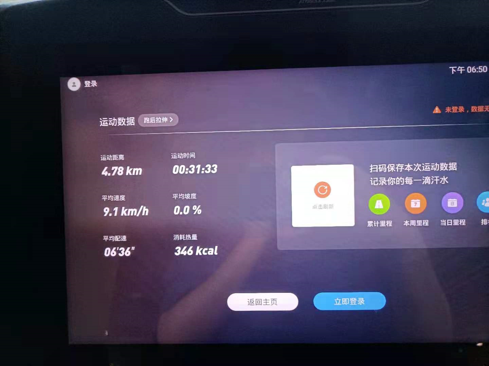

### 210812  大雾  周四

昨晚幸运星要退群，找我俩聊天了。

 

Config连上github了

要坚强。朝目标走。

 

 

很难相信，我早已经在学习和工作里汲取乐趣了，坚持也不是什么困难的事，我一定养成了精神病

我了解艾佳的想法和感受，不一样的是我对较高理智的看法没有那么好，还有一些深入的思考，我学会了规避它们

 

阳哥的学习方法：四个维度：是什么，能干什么，去哪下，怎么玩

永远的helloworld，学习方法上，刷一个新技术，思路上强调这个方法论已经多次，不许懒

以后，学其他技术，没有我了，也可以按这五个维度，一点点的，拱进去，每天，进一寸有进一寸的欢喜

 

第二天补记：

跑步了，玩了其它的器材，别的地方开始酸痛，小腿不咋会有感觉了

然后加了会班，给szl远程看了一下序号，调一下函数就出来了，然后他即刻下班了

讨论了一下项目的设计问题

坐145回去，9、10点了去买了鸡排，宿舍楼下碰到x老师，聊了好一会，他拿出手机算了一下个税和保险，看了一下正式员工的薪资感觉差距不大，说了去大城市钱才能上去，我觉得大城市大厂是目前正确去处。只能说，

时间是金

但是目光放长远，我必须做我真的认同的方向

睡前就没学习，冲浪了

